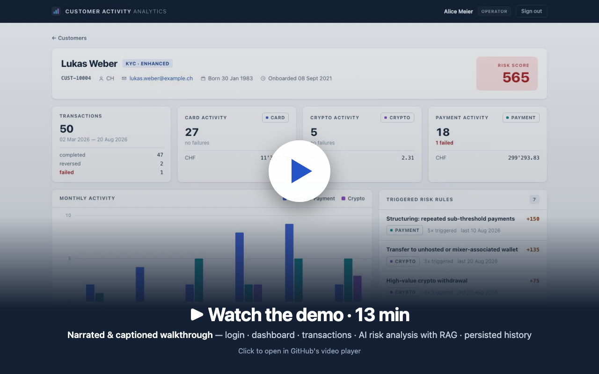
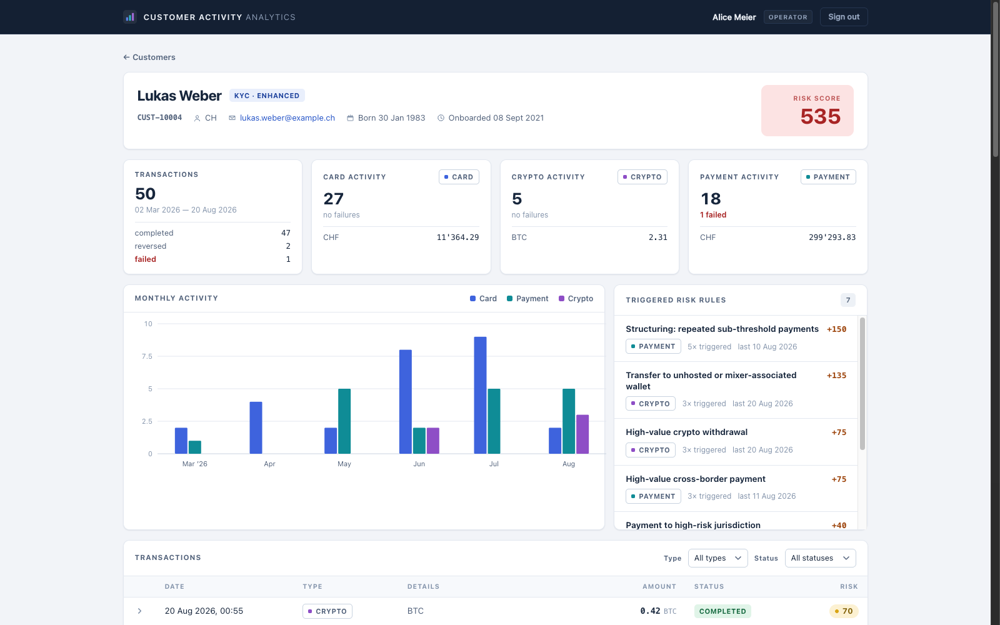
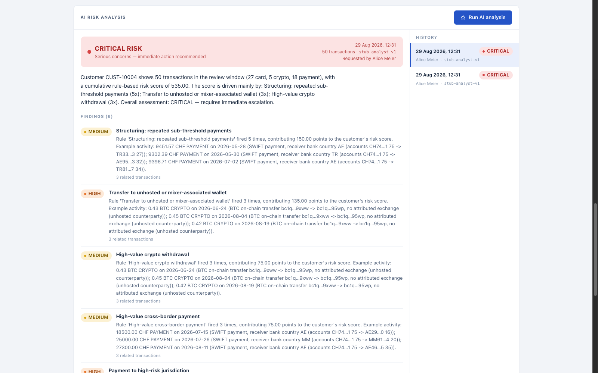

# Customer Activity Analytics

A web application for customer-care operators at a financial-services company: search a
customer, review their **card / payment / crypto** activity on a dashboard, and run a
**persisted, RAG-grounded AI risk analysis** (risk level, findings, recommendations, cited
internal policies).

Built for the Swissquote platform-engineering assignment with **Java 17 + Spring Boot 3.5 +
Hibernate/JPA + PostgreSQL (pgvector) + React/TypeScript** — generated end-to-end with AI
agents (see [docs/ai-methodology.md](docs/ai-methodology.md)).

[](docs/demo/customer-activity-analytics-demo.mp4)

<sub>▶ Click the poster to play the 13-minute walkthrough in GitHub's video player · subtitles: [`.srt`](docs/demo/customer-activity-analytics-demo.srt) · re-recordable with [`scripts/demo-recording`](scripts/demo-recording/README.md)</sub>





## Quick start (Docker)

Prerequisite: Docker with Compose.

```bash
docker compose up --build
```

| Service  | URL |
|----------|-----|
| Frontend | http://localhost:3000 |
| Backend API | http://localhost:8080 |
| PostgreSQL (pgvector) | localhost:5433, db/user/password `caa` |

Demo operator logins (seeded, demo-only): **alice / operator123** (operator) and
**bob / supervisor123** (supervisor).

Everything runs offline by default: the AI analysis uses a deterministic **stub analyst**
that exercises the exact same pipeline (RAG retrieval, prompt, JSON parsing, persistence)
as a real model. To use a real LLM instead:

```bash
ANTHROPIC_API_KEY=sk-ant-... docker compose up --build
```

(`caa.llm.provider` = `auto` | `stub` | `anthropic`; `auto` picks Anthropic
`claude-sonnet-5` when a key is present. Model id configurable via `CAA_ANTHROPIC_MODEL`.)

## Local development

```bash
docker compose up -d db                 # pgvector Postgres on localhost:5433
cd backend && ./mvnw spring-boot:run    # API on :8080 (Flyway migrates + seeds + ingests policies)
cd frontend && npm install && npm run dev   # UI on :5173, /api proxied to :8080
```

Tests:

```bash
cd backend && ./mvnw test      # unit tests (no Docker needed)
cd backend && ./mvnw verify    # + integration test: full operator journey on a Testcontainers pgvector DB
```

## What to try in the demo

Log in as `alice`, then:

| Customer | Story | Expected analysis |
|---|---|---|
| CUST-10004 · Lukas Weber | Structured just-under-10k SWIFT payments to AE/TR, a **blocked payment attempt to a FATF-listed jurisdiction**, large inbound wires converted to BTC within hours and forwarded to one reused **unhosted wallet**, high-value card-not-present spending | **CRITICAL** |
| CUST-10005 · Elena Papadopoulou | Heavy gambling-MCC card spending, quasi-cash purchases, an evening cluster of card declines | **HIGH** |
| CUST-10007 · Yuki Tanaka | Active exchange-based crypto trader; one large withdrawal to a personal cold wallet | **MEDIUM** |
| CUST-10001 · Anna Keller | Routine retail customer (groceries, salary, rent) | **LOW** |

Run the AI analysis on the customer page, inspect findings with their linked transactions
and the cited policy excerpts, then run it again / on other customers — every run is
persisted and browsable in the history panel (including failed runs).

## Architecture

React SPA (nginx, same-origin `/api` proxy) → Spring Boot API (stateless JWT auth) →
PostgreSQL 16 with pgvector. The AI analysis flow: pseudonymised activity digest →
policy-chunk retrieval (RAG over five internal policy documents, embedded at startup) →
prompt → `LlmClient` port (stub or Anthropic adapter) → validated JSON → persisted with
full prompt + raw response for audit.

Details, module map and the reasoning behind each choice: [docs/architecture.md](docs/architecture.md).
API reference: [docs/api-contract.md](docs/api-contract.md).

## Main design decisions

- **Contract-first**: `docs/api-contract.md` was written before the code and is binding
  for backend and frontend; it is also what allowed the frontend to be built by a separate
  AI agent in parallel.
- **Stub LLM as a first-class adapter, not a shortcut**: it emits the same JSON contract a
  real model is prompted for, so provider choice is pure configuration and the demo needs
  no secrets.
- **RAG that works offline**: markdown policies → section chunks → deterministic hashed
  embeddings → pgvector cosine top-k. The embedding model is a port; a hosted provider
  drops in without touching ingestion, storage or retrieval. Citations are validated
  against what was actually retrieved.
- **Auditability over convenience**: every analysis run (including failures) is persisted
  with prompt, raw model output, activity window and requesting operator.
- **Data minimisation towards LLMs**: prompts identify the customer only by customer
  number; name, email and date of birth never leave the database (unit-tested).
- **JPA where it fits, SQL where it's clearer**: entities/CRUD via Hibernate; aggregations
  and vector search via `JdbcTemplate` (JPA has no `vector` type).
- **Deterministic demo data**: `scripts/generate_seed_data.py` (committed, seeded RNG)
  generates 8 behaviour archetypes and re-implements the 10-rule risk catalogue over the
  generated timeline, so seeded risk signals are consistent with the rules they cite.

## Assumptions

- "Search by Customer ID" is interpreted operator-friendly: customer number
  (`CUST-10004`), name fragment, or raw UUID all work.
- The handout schema references a `customers` table without defining it; it was designed
  here (customer number, name, country, KYC level, onboarding date).
- Transaction `status` values are normalised to an uppercase enum
  (`COMPLETED/PENDING/FAILED/REVERSED`).
- Amounts are kept in their original currency (no FX conversion); for crypto rows,
  `amount` is the coin quantity and `currency` the ticker, per the schema note. The seed
  generator uses fixed reference rates only to decide which risk rules fire.
- A customer's risk score is the sum of `risk_assessments.score_contribution` over their
  transactions; the bands (LOW < 50 ≤ MEDIUM < 150 ≤ HIGH < 400 ≤ CRITICAL) are defined
  in the seeded AML policy and mirrored by the stub analyst.
- Analyses run synchronously (an operator clicks and waits a few seconds); a job queue
  would be the scale-up path.
- Demo credentials and a demo JWT secret are committed deliberately; both are
  environment-overridable (`CAA_JWT_SECRET`).

## AI usage summary (assignment "extras")

LLM choices (product + build) and the agent instructions given are summarised in
[docs/ai-methodology.md](docs/ai-methodology.md). In short: built with Claude Code
(Claude Fable 5) using a contract-first, test-verified, multi-agent methodology; the
product defaults to a deterministic stub analyst and upgrades to Anthropic Claude via
configuration.

## Repository layout

```
backend/    Spring Boot 3.5 API (Java 17, Maven wrapper)
frontend/   React 19 + TypeScript + Vite SPA
docs/       api-contract.md · architecture.md · ai-methodology.md · demo-script.md · demo/ (video) · screenshots/
scripts/    generate_seed_data.py (deterministic demo dataset)
CLAUDE.md   standing agent instructions (part of the AI-methodology deliverable)
```

`caa` = **C**ustomer **A**ctivity **A**nalytics — the short name used for the Java package root
(`com.swissquote.caa`), the `caa.*` configuration prefix and `CAA_*` environment variables,
the PostgreSQL database and role, and the `caa-*` container names.

**Recorded demo.** [`docs/demo/customer-activity-analytics-demo.mp4`](docs/demo/customer-activity-analytics-demo.mp4)
is a narrated, captioned 13-minute walkthrough (login, search, dashboard, transactions, AI
analyses, second operator, history, plus architecture and methodology slides) with an
[`.srt`](docs/demo/customer-activity-analytics-demo.srt) subtitle track. It is generated from
the running application by `scripts/demo-recording` (Playwright script, rendered slides,
local Kokoro text-to-speech), so it can be re-recorded at any time; `docs/demo-script.md` is
the narrative it follows.
